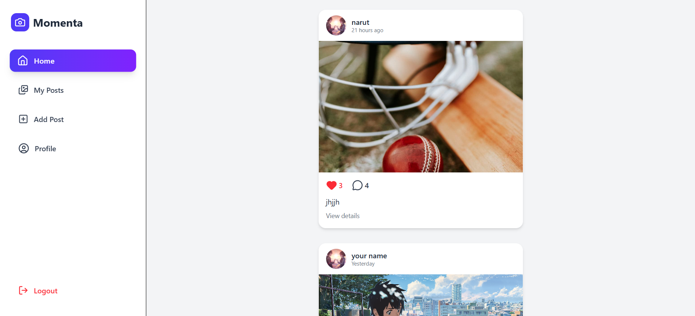
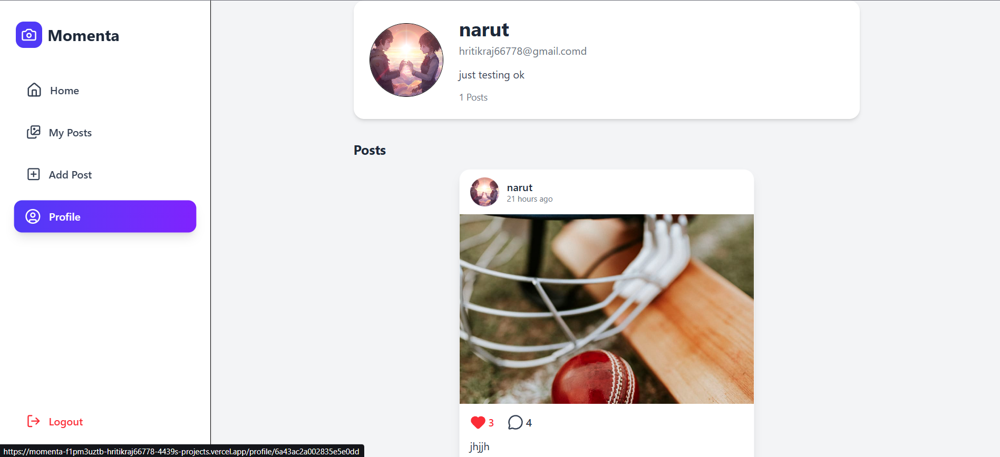
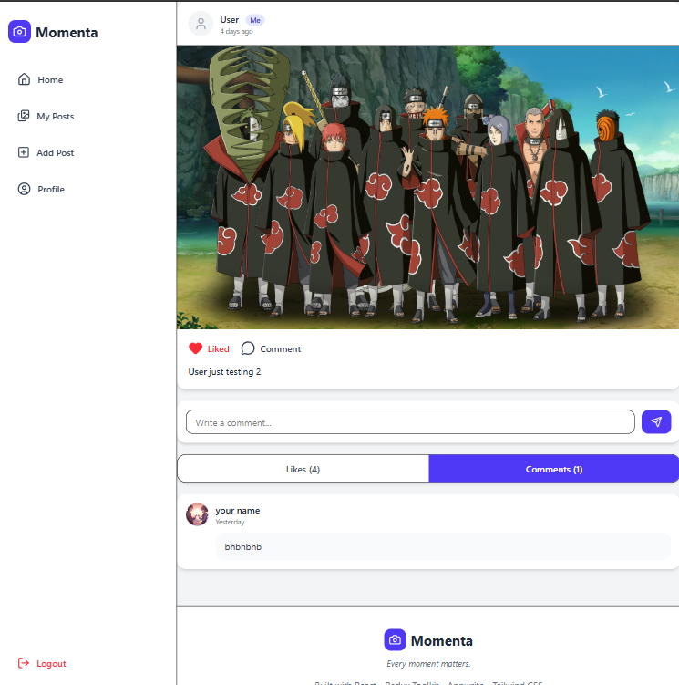
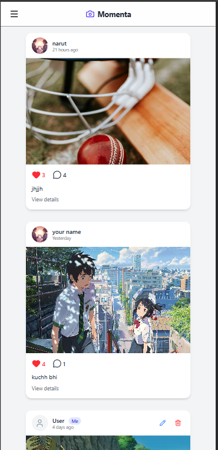

# 📸 Momenta


> **Every moment matters.**

Momenta is a modern full-stack social media web application that enables users to share moments, interact through likes and comments, manage personal profiles, and securely authenticate using Appwrite.

It is built with **React**, **Redux Toolkit**, **Tailwind CSS**, and **Appwrite**, focusing on clean UI, responsive design, and a smooth user experience.

---

## 🚀 Live Demo

🌐 **Live Website:** https://momenta-f1pm3uztb-hritikraj66778-4439s-projects.vercel.app/

---

## 📷 Screenshots

> Add screenshots after deployment.

| Home | Profile | Post Details |Mobile view|
|------|---------|--------------|-----------|
|  |  |  | |  |

---

# ✨ Features

## 🔐 Authentication

- User Registration
- Secure Login & Logout
- Email Verification
- Resend Verification Email
- Forgot Password
- Reset Password
- Persistent Login Session
- Protected Routes

---

## 👤 User Profile

- Upload Profile Avatar
- Edit Profile
- Update Bio
- View Own Profile
- View Other Users' Profiles

---

## 📸 Posts

- Create New Post
- Upload Images
- Edit Post
- Delete Post
- Relative Time Display
- Automatic Cleanup of Likes & Comments on Post Deletion

---

## ❤️ Social Features

- Like / Unlike Posts
- Comment on Posts
- Delete Own Comments
- Like & Comment Count
- "Me" Badge for Current User

---

## 🎨 User Experience

- Fully Responsive Design
- Mobile Sidebar Navigation
- Sticky Mobile Header
- Skeleton Loaders
- Empty States
- Beautiful Toast Notifications
- Custom Confirmation Dialogs
- 404 Not Found Page
- Network Error Handling
- App Loading Screen

---

# 🛠 Tech Stack

### Frontend

- React.js
- React Router DOM
- Redux Toolkit
- React Hook Form
- Tailwind CSS
- Lucide React
- React Icons
- Sonner (Toast)

### Backend

- Appwrite Authentication
- Appwrite Database
- Appwrite Storage

---

# 🗂 Database Structure

## Posts

- userId
- caption
- imageId
- \$createdAt

---

## Profiles

- userId
- name
- email
- avatarId
- bio

---

## Likes

- postId
- userId

---

## Comments

- postId
- userId
- content

---

# 📁 Folder Structure

```text
src
│
├── appwrite/
│   ├── Auth.js
│   └── config.js
│
├── components/
│
├── pages/
│
├── store/
│
├── utility/
│
├── conf/
│
└── App.jsx
```

---

# ⚙️ Environment Variables

Create a `.env` file in the root directory.

```env
VITE_APPWRITE_URL=
VITE_APPWRITE_PROJECT_ID=
VITE_APPWRITE_DATABASE_ID=
VITE_APPWRITE_POST_COLLECTION_ID=
VITE_APPWRITE_PROFILE_COLLECTION_ID=
VITE_APPWRITE_COMMENT_COLLECTION_ID=
VITE_APPWRITE_LIKE_COLLECTION_ID=
VITE_APPWRITE_BUCKET_ID=
VITE_APP_URL=
```

---

# 💻 Installation

Clone the repository

```bash
git clone https://github.com/yourusername/momenta.git
```

Go into the project

```bash
cd momenta
```

Install dependencies

```bash
npm install
```

Start development server

```bash
npm run dev
```

---

# 🚀 Build

```bash
npm run build
```

---

# 🌟 Future Improvements

- Follow / Unfollow Users
- Search Users
- Notifications
- Infinite Scrolling
- Stories
- Multiple Image Upload
- Video Posts
- Saved Posts
- Dark Mode

---

# 👨‍💻 Author

**Prince Raj**

- GitHub: https://github.com/princeritik
- LinkedIn: https://linkedin.com/in/prince-raj-a39a2328a

---

# 📄 License

This project is licensed under the MIT License.

---

## ❤️ Thank You

Thank you for visiting **Momenta**.

> **Every moment matters.**